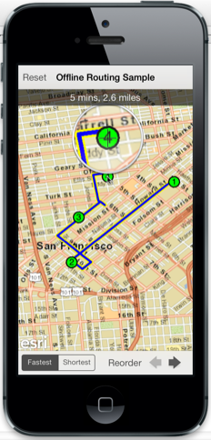
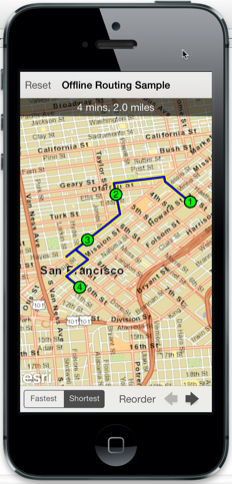
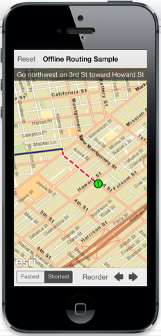

##Offline Routing Sample (Beta)

This sample demonstrates how you can compute routes even when the device does not have any network connectivity.
The sample contains a network dataset with information about the streets network for the downtown San Francisco area. Routes
are computed based on this dataset. The sample displays basemap tiles using a tile package (.tpk file) so that the basemap
is visible even when the device is offline.

**Note:** This sample uses functionality that is in beta at v10.2 of ArcGIS Runtime SDK for iOS.

###Using the sample
1. Tap-and-hold anywhere on the map to add a stop. Move your finger while still holding down on the map to move the stop. 
2. A route is computed between the stops, and updated as you move your finger. The banner on the top shows travel time and distance.
3. You can add another stop by releasing your finger, and then tap-and-holding again.
4. You can switch between the **Shortest** and the **Fastest** options to update the route.
5. You can tap on **Reorder** to rearrange the stops and find the best route.
6. You can use the **Prev** and **Next** buttons to step through the directions turn-by-turn. 
7. Tap **Reset** to clear all stops/routes and start again.






###Using the API
The ```RoutingSampleViewController``` contains an ```AGSMapView``` to display a map. The map view contains an 
AGSLocalTiledLayer to display tiles from SanFrancisco.tpk tile package. The view controller initializes
n ```AGSRouteTask``` with the RuntimeSanFrancisco network dataset to use for computing routes. The stops and route results are 
displayed as graphics using an ```AGSGraphicsLayer```. The map view's touchDelegate is used to track tap-and-hold 
gestures on the map and add stops. Changing route options to reorder stops or find the shortest v/s fastest routes is achieved by
modifiying properties on ```AGSRouteTaskParameters``` and recalculating the route. Displaying turn-by-turn directions is achieved by
iterating through the ```AGSDirectionSet``` associated with each route result.


